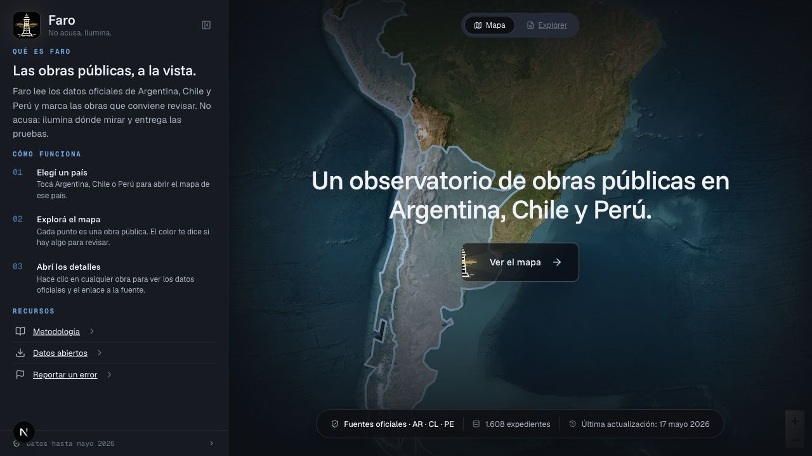
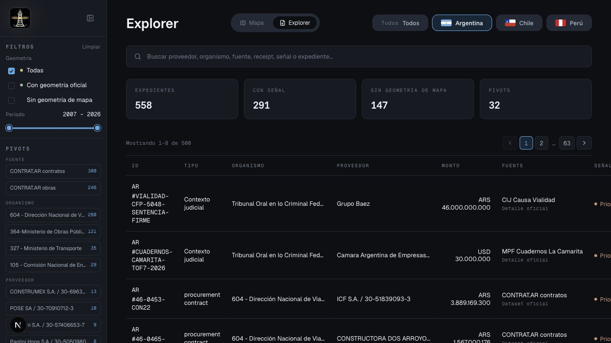

# Faro Argentina

**El poder deja rastros. Faro los ordena.**

Faro Argentina convierte datos oficiales de gasto publico en expedientes
verificables para seguir obras, contratos, organismos, proveedores y fuentes sin
saltar a conclusiones.

Faro no acusa. Faro muestra donde mirar, por que mirar ahi, que fuente oficial
lo sostiene y que falta verificar.



_Entrada a Faro: una capa publica y directa antes de entrar al mapa o al
Explorer._



_Explorer investigador: busqueda, pivots, receipts, fuentes oficiales y
expedientes exportables._

## Por Que Existe

La informacion sobre gasto publico existe, pero esta dispersa en portales,
CSVs, APIs, PDFs y datasets con campos inconsistentes. Para verificar una pista
hay que encontrar la fuente, entender el registro, cruzar identificadores,
revisar montos, ubicar territorio, guardar hashes y explicar caveats.

Faro reduce esa distancia:

```text
datos oficiales -> pista -> expediente -> fuente oficial -> evidence pack
```

## Workflow

El flujo principal esta enfocado en Argentina:

1. Abrir el mapa o el Explorer.
2. Encontrar una pista por territorio, organismo, proveedor, fuente o senal.
3. Abrir el expediente.
4. Revisar rastro oficial, receipts, hashes y caveats.
5. Exportar informe imprimible o JSON tecnico para continuar la verificacion.

El momento clave no es "mira un punto en el mapa". Es:

```text
esta pista -> esta fuente oficial -> este receipt -> este paquete verificable
```

## Que Hace

Tocas un punto del mapa o una fila del Explorer y Faro arma un expediente con:

- resumen del caso en lenguaje claro;
- organismo, proveedor, monto, fecha y territorio cuando existen;
- senales investigativas sin lenguaje acusatorio;
- fuente oficial publica para abrir en el portal original;
- receipts reproducibles con raw path, snapshot hash, row hash y parser version;
- caveats sobre lo que la fuente no prueba;
- siguientes pasos de verificacion;
- informe imprimible y export JSON tecnico.

## Lo Que Lo Hace Diferente

- **Fuente oficial primero:** la UI abre paginas oficiales de catalogo o detalle;
  los links directos a datasets quedan para reproducibilidad tecnica.
- **Receipts verificables:** cada caso conserva hashes, paths y version de parser.
- **Explorer antes que sospecha:** se puede seguir el rastro por fuente,
  organismo, proveedor, senal o identificador.
- **Mapa con prudencia:** solo se dibuja geometria validada; lo debil queda como
  brecha de datos, no como punto inventado.
- **Caveats visibles:** contratos y adjudicaciones no se presentan como pagos si
  no hay una fuente que lo pruebe.

## Estado Actual

Corpus versionado en el repo segun los reportes generados del 2026-05-21:

- `6` datasets generados;
- `7.932` expedientes de Argentina;
- `9.617` receipts;
- `11` archivos raw verificados;
- `431` expedientes elegibles para mapa despues del gate de geometria.

Para confirmar la linea base actual, ejecutar:

```bash
npm run data:geo-report
npm run data:quality-report
```

La cobertura se concentra en:

- CONTRAT.AR obras, contratos, procedimientos, ofertas, ubicacion geografica y
  actas de apertura;
- SIPRO proveedores;
- Mapa de Inversiones como cobertura de avance declarada, buscable y
  exportable, pero no map-safe en el snapshot actual porque el CSV no trae
  latitud/longitud;
- BCRA Comunicacion A 3500 para conversiones historicas;
- CIJ Causa Vialidad;
- MPF Causa Vialidad;
- MPF Cuadernos / La Camarita;
- Contratar historico obras como fuente auxiliar.

### Currentness Y Brechas

El manifest de snapshots fue generado el `2026-05-18`, con Mapa de Inversiones
agregado el `2026-05-21`. Los expedientes pueden ser buscables aunque no sean
map-safe: los casos sin geometria oficial validada siguen en Explorer, informes
y exports como brechas de datos.

Faro no geocodifica, infiere ni corrige coordenadas. Coordenadas invalidas,
duplicadas, placeholder, fuera de bounds o sospechosas quedan fuera del mapa y
se conservan como datos a verificar.

## Superficies Del Producto

### Explorer

El Explorer es el modo principal de investigacion. Permite buscar por proveedor,
organismo, fuente, receipt, senal o texto libre, y combinar pivots sin depender
del mapa.

### Mapa

El mapa orienta territorialmente solo cuando la geometria pasa controles de
calidad. Coordenadas placeholder, duplicadas, fuera de bounds, sospechosas o
marcadas como malas quedan fuera del mapa y siguen disponibles en
Explorer/export.

### Expediente

El expediente es la unidad central: explica por que el caso aparece, que fuente
lo sostiene, que caveats aplican y que deberia verificarse despues.

### Evidence Pack

El export tecnico conserva el rastro reproducible: caso, receipt, fuentes
relacionadas, senales, caveats, hashes y pasos de verificacion.

## Stack

- Next.js 16;
- React 19;
- TypeScript;
- Leaflet / React Leaflet;
- datos publicos generados y versionados en el repo;
- Clerk para autenticacion de superficies privadas e internas;
- Neon Postgres para estado privado estructurado cuando `DATABASE_URL` esta
  configurado;
- Cloudflare R2 compatible S3 para adjuntos privados de Aportes cuando el
  storage esta configurado.

## Estructura

```text
src/lib/caseRepository.ts              # fachada de datos para UI y APIs
src/lib/data/                          # normalizacion, senales, receipts, explorer
src/components/                        # landing, mapa, explorer, inspector, expediente
src/app/api/                           # endpoints thin para casos, leads, export, readiness
scripts/                               # fetch/build/verify de datos oficiales
data/official/                         # snapshots oficiales locales
data/sources/source-catalog.json       # catalogo de fuentes oficiales
src/data/                              # artefactos generados para la app
docs/                                  # documentacion publica y handoffs vigentes
```

## Correr Localmente

```bash
npm install
npm run dev
```

Por defecto:

```text
http://127.0.0.1:3002
```

Si el puerto esta ocupado, Next puede ofrecer otro puerto local.

## Verificacion

```bash
npm run data:verify
npm run data:geo-report
npm run data:quality-report
npm test
npm run typecheck
npm run build
```

`npm run data:verify` valida catalogo, raw hashes, snapshot profiles y receipts.
`npm run data:geo-report` valida elegibilidad de mapa. `npm run
data:quality-report` resume cobertura por fuente, monto, proveedor, geometria,
senales y blockers.

No usar fetch de datos como reparacion rutinaria:

```bash
npm run data:fetch:all
```

Ese comando refresca fuentes externas y puede cambiar la linea base de
evidencia.

## Documentacion

- [Mapa de documentacion](docs/README.md)
- [Contexto de producto](docs/product/faro-product-context.md)
- [Onboarding tecnico](docs/agent-onboarding.md)
- [Deployment](docs/deployment.md)
- [Runbook de produccion](docs/operations/production-runbook.md)

## Descripcion Corta

Faro Argentina convierte datos oficiales de gasto publico en expedientes
verificables con Explorer, mapa prudente, fuentes oficiales, receipts, caveats e
informes exportables.
